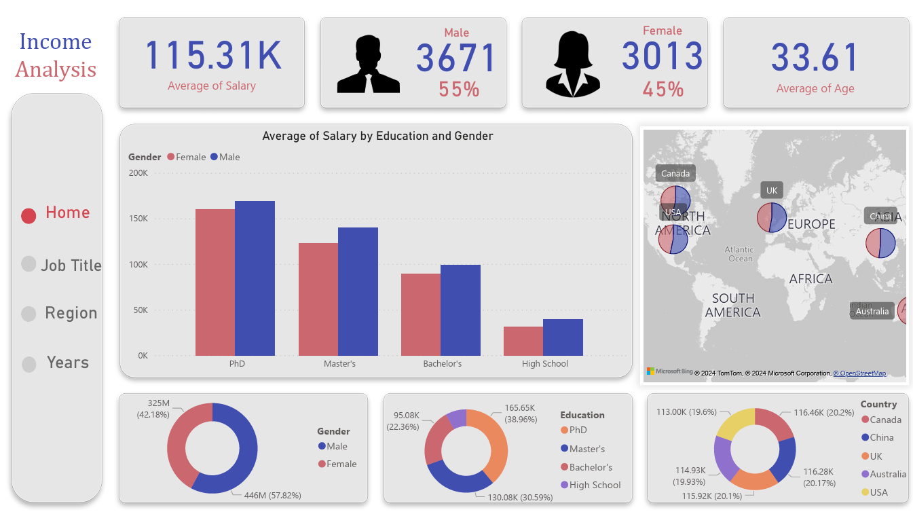
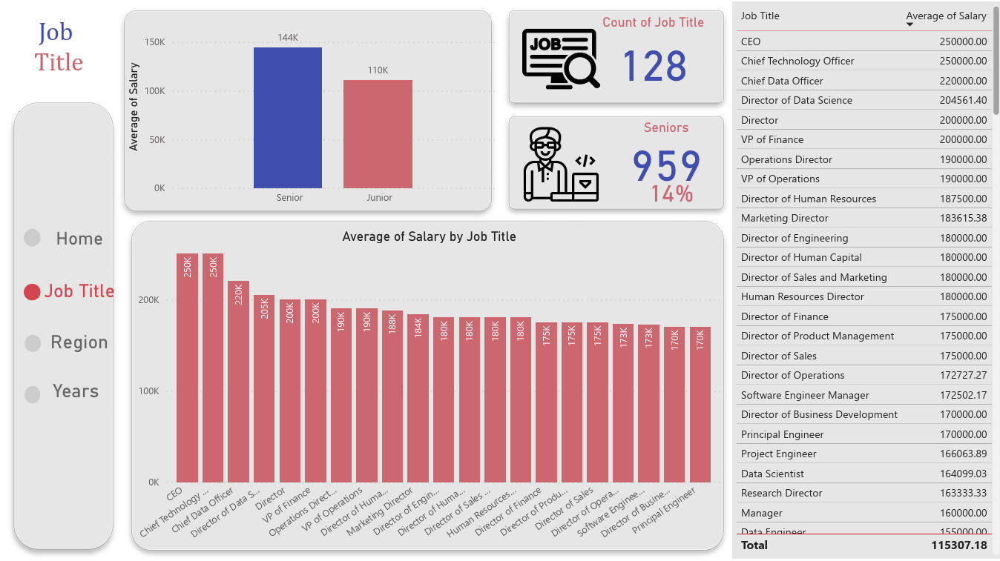
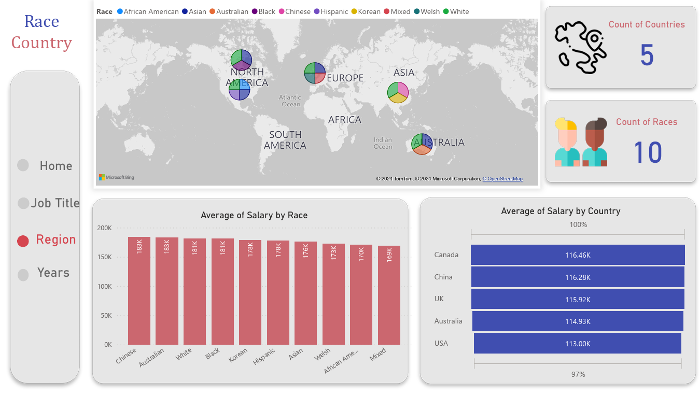
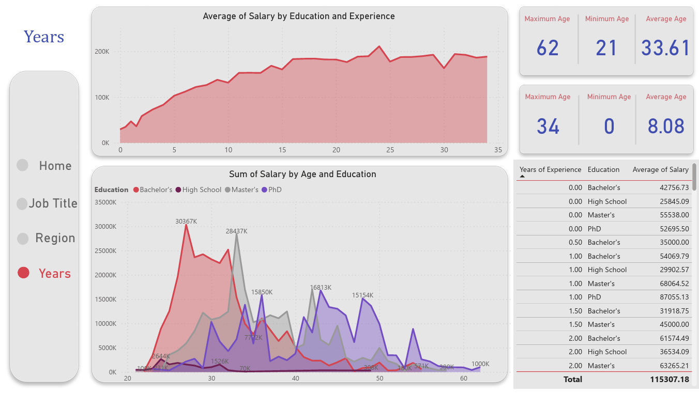

### Project Title: Advanced Salary Prediction Using Regression Analysis

#### Overview:
In this comprehensive project, I applied machine learning techniques and statistical methods to predict salaries based on various job-related features. Utilizing a rich dataset that includes variables such as country, region, age, years of experience, and education level, I embarked on a journey to uncover the intricate relationships between these factors and individual income levels. The goal was to develop a robust regression model capable of providing accurate salary predictions, thereby offering valuable insights for career planning and workforce analysis.

#### Project Phases:

- **Data Preprocessing**: Implemented thorough data cleaning processes to address missing values, duplicate entries, and incorrect data entries, ensuring the integrity and reliability of the analysis.
- **Feature Engineering**: Enhanced the dataset by identifying and creating relevant features that significantly impact salary predictions, such as normalized experience levels and adjusted education factors.
- **Exploratory Data Analysis (EDA)**: Conducted an in-depth exploratory analysis to understand the distributions, correlations, and patterns within the data, utilizing advanced visualization techniques to uncover hidden insights.
- **Model Development**: Trained a sophisticated regression model from scratch, incorporating techniques like gradient descent and L2 regularization to optimize performance and accuracy.
- **Dimensionality Reduction**: Applied dimensionality reduction techniques to streamline the dataset, improving model efficiency without sacrificing prediction quality.
- **Handling Overfitting**: Employed strategies to mitigate overfitting, ensuring the model's generalizability to unseen data.
- **Model Evaluation**: Critically evaluated the model's performance using standard metrics, demonstrating its predictive accuracy and reliability.

#### Technical Innovations:

- **Normalization Techniques**: Explored various normalization methods to manage outliers effectively, starting with Logarithmic Normalization and subsequently applying Winsorization for enhanced data stability and model robustness.
- **Custom Regression Implementation**: Developed a bespoke regression algorithm, showcasing the ability to build predictive models from the ground up, highlighting an understanding of the underlying mathematical principles.
- **BI Dashboard Development**: Created an interactive Business Intelligence (BI) dashboard to visualize the model's predictions and data insights dynamically, facilitating intuitive understanding and decision-making.

#### Achievements:

- Achieved a high level of prediction accuracy, demonstrating the effectiveness of the feature engineering and model training strategies employed.
- Provided comprehensive documentation and storytelling in the project notebook, elucidating each step of the process with clear explanations and rationale.
- Advanced the field by sharing detailed analyses and methodologies, contributing valuable knowledge to the community.

#### Tools & Technologies Used:

- Data Analysis and Modeling: Python (Pandas, NumPy, Scikit-learn)
- Data Visualization: Matplotlib, Seaborn, BI tools for dashboard creation
- Mathematical Computation: Implementation of Gradient Descent, L2 Regularization from scratch

#### Reflections and Future Work:

This project not only enhanced my technical skills in data science and machine learning but also deepened my understanding of the factors influencing salary dynamics across different industries and roles. Going forward, I plan to explore more sophisticated models and feature selection techniques to further refine the accuracy of salary predictions. Additionally, I aim to expand the dataset to include more variables and potentially apply these models to other domains of workforce analytics.

---


At the next step I found that there is a problem in multi-linear regression algorithm because I took a good result in training accuracy but the test one was really terible, so I decided to use different ways like three regularizaiton way (Lasso, Ridge, Elastic Net) or using the PCA for dimention reduction and .... that i have mentioned them completely in the notebook.

At the End I implemened the Linear Regression :
```python
def compute_cost(x, y, w, b):
    total_cost = 0
    m = len(x)
    for i in range(m):
        f_wb = w * x[i] + b
        total_cost += (f_wb - y[i]) **2
    total_cost = total_cost / (2*m)
    return total_cost
```
```python
def compute_gradient(x, y, w, b):
    m = len(x)
    dj_dw = dj_db = 0
    temp_dw = temp_db = 0
    for i in range(m):
        f_wb = w * x[i] + b
        temp_dw += (f_wb - y[i]) * x[i]
        temp_db += (f_wb - y[i])
    dj_dw = temp_dw / m
    dj_db = temp_db / m
    return dj_dw, dj_db
```

```python
def Gradient_descent(x, y, w, b, alpha, epochs):  
    J_history = []
#     p_history = []
    for i in range(epochs):
        dj_dw, dj_db = compute_gradient(x, y, w, b)
        w = w - alpha * dj_dw
        b = b - alpha * dj_db
        
        J_history.append(compute_cost(x, y, w , b))
#             p_history.append([w,b])
        if i% math.ceil(epochs/10) == 0:
            print(f"Iteration {i:4}: Cost {J_history[-1]:0.2e} ",
                  f"dj_dw: {dj_dw: 0.3e}, dj_db: {dj_db: 0.3e}  ",
                  f"w: {w: 0.3e}, b:{b: 0.5e}")
    return w, b, J_history
```
And Multi-linear Regression and l2 regularization too that i mentioned them in notebook.
# Importent Urls:

+ <h4>Data Base Link: <a href="https://www.kaggle.com/datasets/amirmahdiabbootalebi/salary-by-job-title-and-country">Link</a></h4>
+ <h4>Colab Notebook Link: <a href="https://colab.research.google.com/drive/1mVqH1VBxk9l5MzJLjwQ8m6CwF6QqRHXf?usp=sharing">Link</a></h4>
+ <h4>Kaggle Notebook Link: <a href="https://www.kaggle.com/code/amirmahdiabbootalebi/with-this-notebook-you-don-t-need-any-courses">Link</a></h4>





